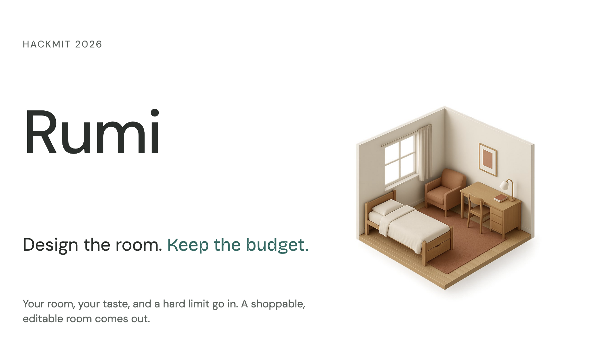
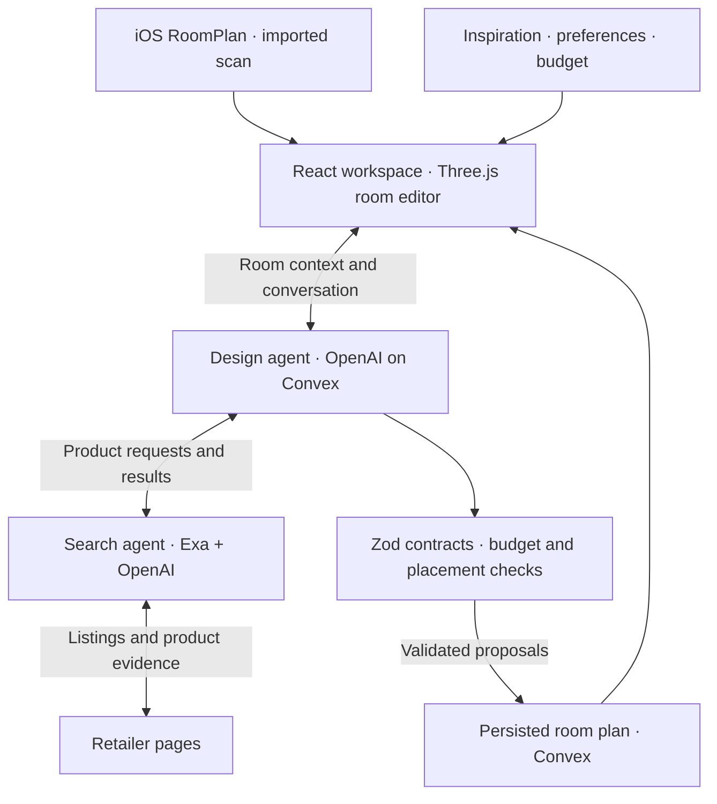

# Rumi



An AI interior shopping agent that brings your room, taste, and budget into one editable 3D workspace. Find real furniture across stores, explore it in context, and refine your plan through chat.

Built at **HackMIT 2026** · [Project submission](https://plume.hackmit.org/project/aajnp-oqnis-ttafi-kbgks)

**Powered by**

| [](https://openai.com/) |        [](https://exa.ai/)        |                    [](https://www.convex.dev/)                     | [](https://clerk.com/) |
| :------------------------------------------------------------------: | :----------------------------------------------------------------------: | :-------------------------------------------------------------------------------------------------------------: | :---------------------------------------------------------------: |
|  [](https://react.dev/)   | [](https://threejs.org/) | [](https://developer.apple.com/augmented-reality/roomplan/) |                                                                   |

**Built with help from**

| [](https://openai.com/codex/) | [](https://devin.ai/) |
| :----------------------------------------------------------------------: | :--------------------------------------------------------------: |

## From room to plan

1. **Capture your space.** Scan with the iOS RoomPlan app, import a capture, or explore a labeled sample room.
2. **Describe your vision.** Share inspiration photos, a budget, and furniture you want to keep.
3. **Find real products.** The agents search merchant listings and evaluate price, dimensions, and style.
4. **Explore and refine.** Edit the room, switch between overhead and first-person views, and continue the conversation with your room as context.

> “Help me furnish my dorm for $800 with a desk, chair, rug, lamp, and storage, while keeping my existing bed.”

## How it works



**The model proposes; code checks.** OpenAI interprets taste, images, and product information. TypeScript validates proposals against the budget, dimensions, doorway clearance, and room revision. Geometry uses meters; prices use integer cents.

| Layer                    | Implementation                                                                        |
| ------------------------ | ------------------------------------------------------------------------------------- |
| Room capture             | Swift + Apple RoomPlan; scan import and browser pairing                               |
| Workspace                | React, Vite, TypeScript, Tailwind, Zustand                                            |
| 3D editor                | Three.js, React Three Fiber, Drei                                                     |
| Agents and persistence   | Convex, OpenAI, Exa; Clerk authentication                                             |
| Contracts and validation | Zod, shared geometry and budget functions, Bun tests                                  |
| Furniture visualization  | Product photos → OpenAI → validated parametric geometry, scaled to catalog dimensions |

Original scans and editor history stay browser-local; authenticated conversations and their room snapshots persist in Convex. The asset pipeline produces approximate previews and is separate from live search; missing assets render as dimensioned boxes.

**Current scope:** automatic placement supports rectangular rooms. Polygon scans can inform chat and search. Listed, estimated, and unknown dimensions remain distinct. Budgets use listed product prices before shipping and tax; checkout is not implemented.

## Run locally

Requires [Bun](https://bun.sh). For the local room editor and sample data:

```sh
bun install
bun run dev
```

For authenticated chat, live search, and phone pairing, follow the [Convex setup](convex-workflow.md), [chat configuration](docs/agent-integration.md), and [iOS setup](ios/README.md).

- **Frontend:** `VITE_CONVEX_URL`, `VITE_CLERK_PUBLISHABLE_KEY`; set `VITE_CAPTURE_PAIRING_ENABLED=true` to show phone pairing.
- **Backend:** `CLERK_JWT_ISSUER_DOMAIN`, `CHAT_ALLOWED_ORIGINS`, `OPENAI_API_KEY`, `EXA_API_KEY`. Keep provider keys in the Convex deployment, never in `VITE_` variables.

```sh
bun run typecheck
bun run lint
bun test
```

Full checks require `convex/_generated` bindings from a configured deployment. `bun run typecheck:shared` checks shared code and offline test dependencies without them.

## Explore the code

| Area                                                      | Guide                                              |
| --------------------------------------------------------- | -------------------------------------------------- |
| `src/features/` · room workspace and chat                 | [Agent integration](docs/agent-integration.md)     |
| `ios/` · native capture app                               | [iOS setup](ios/README.md)                         |
| `convex/` · authenticated backend and agents              | [Backend workflow](convex-workflow.md)             |
| `shared/search/` · discovery and ranking                  | [Search pipeline](docs/search-agent.md)            |
| `shared/assets/` · parametric furniture models            | [Image-to-3D pipeline](docs/asset-generation.md)   |
| `shared/contracts/`, `shared/geometry/`, `shared/budget/` | [Data and coordinate contracts](docs/contracts.md) |

Built by Srinivas Indavara Badrinath, Bryan Lin, Firdavs Boliev, and Kristen Ho.
